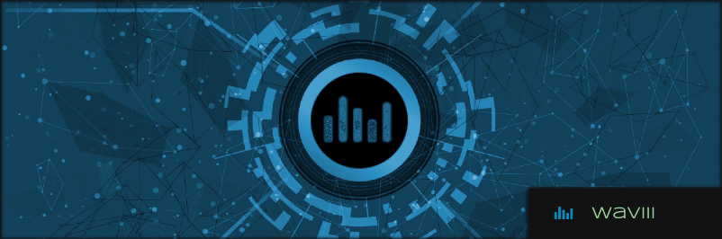

## waviii-wallet
ERC-20 Token Wallet for the waviii Ethereum Token.

#### Issues

- [x] [Integrate with smartcontract, Initial setup](https://github.com/MBrassey/waviii-wallet/issues/1)
- [x] [Locked View, React Animations & App Cleanup](https://github.com/MBrassey/waviii-wallet/issues/2)
- [x] [Complete Documentation / Deploy 2 IPFS](https://github.com/MBrassey/waviii-wallet/issues/3)

#### The waviii Token
waviii Token is the Mainnet ERC-20 Ethereum Token waviii-wallet was designed for. The Max Supply of waviii is one million. The live Token Smartcontract can be viewed on [Etherscan](https://etherscan.io/token/0x9cc6754d16b98a32ec9137df6453ba84597b9965) and its Source Code on [GitHub](https://github.com/MBrassey/waviii-token).

> Token
> 

#### IPFS

The waviii-wallet react component is [deployed](https://waviii-wallet.on.fleek.co/) to IPFS. The images, text, styles and javascript are all hosted on the InterPlanetary FileSystem (IPFS) in a fully decentralized way. In connjunction with the Ethereum SmartContract backend, waviii-wallet is a dApp (Decentralized Application). As there is no central point of failure or central point of management, the dApp is highly redundant as well as highly censorship resistant.

#### Requirements

    node
    npm

#### Installation

    npm i

#### Usage

    npm run start
    browse: localhost:3001/

<h6>
:cyclone: Click the image(s) below to view the live <a id="Screenshots" href="https://waviii-wallet.on.fleek.co/">webapplication</a>
</h6>

> Preview
> 

> No MetaMask Installed
> 

> Setup
> 

#### Questions

Contact me at [matt@brassey.io](mailto:matt@brassey.io) with any questions or comments.

#### License

`waviii-wallet` is published under the **CC0_1.0_Universal** license.

> The Creative Commons CC0 Public Domain Dedication waives copyright interest in a work you've created and dedicates it to the world-wide public domain. Use CC0 to opt out of copyright entirely and ensure your work has the widest reach. As with the Unlicense and typical software licenses, CC0 disclaims warranties. CC0 is very similar to the Unlicense.
